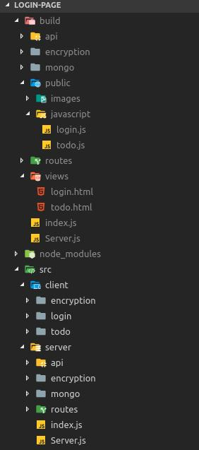

# Sample Login Page
이 프로젝트는 MongoDB, Node, React를 이용한 샘플 로그인 페이지를 만든 프로젝트 입니다.

이 프로젝트가 사용하는 Node버젼은 10.15.3입니다.
(구 버전의 Node는 scrypt모듈에 scrypt알고리즘이 없을 수도 있습니다.)

## Install
### 프로젝트 설치
    > git clone https://github.com/jekyem/login-page.git
    > npm install
### 몽고 DB 설치
    MongoDB [홈페이지](https://www.mongodb.com/)에서 설치

## 실행 명령어
    > npm start
        서버 실행(localhost:8080) watch 모드로 소스 변경시 바로 적용
    > npm run build
        FrontEnd, Backend build
    > npm run buildServer
        Backend build
    > npm run buildClient
        Frontend build
    > npm run watchServer
        Backend watch 모드로 build
    > npm run watchClient
        Frontend watch 모드로 build

## 디렉토리 구성 및 웹팩 구성
### 디렉토리
src 디렉토리는 client, server 2부분으로 나뉘어져 있다.

>
> #### client
> 1개의 Page당 1개의 폴더를 가진다.
>
>(encryption은 예외 적으로 모든 페이지에서 사용목적으로 최 상위 폴더에 위치 시켰다.)
>
>#### server
>일반 express 프로젝트와 비슷한 폴더 구성을 가진다.
>
>routes폴더는 route관련된 모듈들이 있고, api는 webAPI관련 모듈이 있다.
>
>나머지 폴더들은 서버에서 사용할 클래스 및 모듈의 폴더이다.
>
&nbsp;&nbsp;&nbsp;&nbsp;&nbsp;&nbsp;&nbsp;&nbsp;&nbsp;&nbsp;&nbsp;&nbsp;
>
>#### webpack / babel
>이 프로젝트는 React(Front), ES6(Back)를 사용하고 있다. 그렇기 때문에 Webpack, Babel을 통해 Es5문법으로 변환 해야한다.
>
>webpack의 역할은 2가지이다.
>첫 번째 역할은 Front-end의 page별로 bundle 하는 것이다. bundle의 결과물은 build/views, build/javascript에 저장된다.
>두 번째는 Back-end의 Key File을 Copy하는 것이다.
>
>Back-end의 코드들은 Babel을 통해 ES5로 build후 build폴더에 저장 한다.

## DB구성
Database name : todo-list

Schma 정보
~~~
user{
        id: {type: String, required: true, unique: true},
        password: {type: String, required: true},
        salt: {type: String, required: true}
}
~~~
    

## 암호화
1. 통신 암호화

    Https를 사용하지 않으므로, 통신 암호화는 필수 이다.
    암호화를 위해 RSA, AES를 사용한다.

2. 페스워드 해시

    패스워드는 Scrypt알고리즘으로 Hash를 만든 뒤 DB에 저장 합니다. 그 후, 로그인 마다 Hash를 생성 하고 그 값을 DB에 저장 된 값과 비교 합니다.